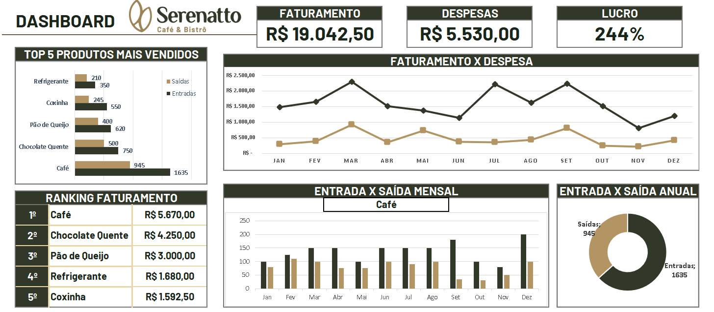

# ☕ Dashboard Financeiro - Serenatto Café

> **Status do Projeto:** Concluído

Este projeto consiste em um dashboard analítico desenvolvido em Excel para monitoramento da performance de vendas e saúde financeira da cafeteria **Serenatto**. Ele transforma dados brutos de transações em insights estratégicos, permitindo visualizar a rentabilidade e o fluxo de caixa de forma clara e interativa.

## Sumário
- [Tecnologias](#tecnologias)
- [Funcionalidades](#funcionalidades)
- [Visualização](#visualização)

---

## Tecnologias
- **Microsoft Excel**: Ferramenta principal para análise e visualização.
- **Tabelas Dinâmicas**: Para processamento e consolidação de grandes volumes de dados.
- **Fórmulas Avançadas**: Utilizadas para cálculos de margem, lucro e indicadores financeiros.
- **Dashboard Design**: Focado em facilitar a leitura de KPIs.

---

## Funcionalidades
- **Cards de Indicadores Financeiros**: Visualização rápida de Faturamento Total, Despesas e Margem de Lucro.
- **Análise de Mix de Produtos**: Ranking dos Top 5 produtos mais vendidos e impacto no faturamento.
- **Fluxo de Caixa Temporal**: Comparativo visual entre Entradas e Saídas (Mensal e Anual).
- **Filtros Interativos**: Segmentação por período e categorias para análise granular.
- **Modelagem de Dados**: Estrutura organizada entre cadastros (Produtos/Fornecedores) e movimentações.

---

## Visualização

